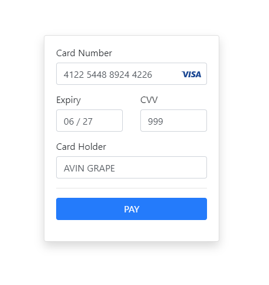

# Payment form 

Example of a payment form built with [Knockout](https://knockoutjs.com/) and [Bootstrap](https://getbootstrap.com/). 

Live version is [here](https://avin.github.io/ko-payment-form).

Also see same form built with Vue.js [here](https://github.com/avin/vue-payment-form).

